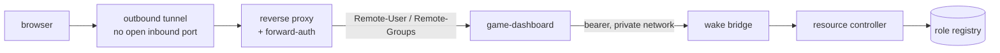

# game-dashboard

A small web UI in front of an on-demand resource controller. The controller keeps
a memory-constrained node quiet by running only one heavy role at a time, and this
is the front end that lets a handful of trusted people wake a role themselves
without going through me first. It shows which roles are up and which are asleep,
whether anyone is on them, and how much memory the node has left.

## Why the roles are enforced on the server

Identity arrives from a forward-auth layer as request headers. Convenient, and
useless as a boundary on its own: headers are just text, and anything that reaches
the app directly can claim to be an administrator.

So the app accepts only what came through the proxy. Everything else gets a 403
before a handler runs, and every privileged action checks the group again on the
server side. The frontend does hide buttons a viewer cannot use, but that is a
convenience for the person looking at the screen. Deleting the check in the
browser would not gain anyone a single extra permission.

There are two roles, and that is on purpose:

| Group | May |
|-------|-----|
| `user`  | see the roles and start (wake) them |
| `admin` | additionally stop, restart, and displace an occupied slot |

## Design notes

- **The role list comes from the controller.** It is read from the registry at
  runtime, so a role added on the node appears here without a code change or a
  redeploy.
- **The lab machines are left out.** They stay behind the administrative portal.
  A dashboard I share with friends has no business reaching them.
- **The bridge token never reaches the browser.** The UI talks to this service,
  and this service talks to the bridge.
- **Nothing listens on a public port.** Access runs through an outbound tunnel,
  and the service binds to loopback.

## Layout

- `app/auth.py`: trusted-proxy check and group enforcement
- `app/bridge.py`: client for the wake bridge, including bearer handling
- `app/games.py`: role list derived from the controller's registry
- `app/main.py`: routes and the server-side permission checks
- `app/static/`: the UI, one HTML file with a stylesheet and a script, no framework
- `docker-compose.yml`: hardened runtime, read-only with dropped capabilities and a loopback bind

MIT licensed.

## About this snapshot

The private version of this repo contains the real group names, the proxy
configuration and the address of the bridge it talks to. A script removes those,
replaces internal addresses and paths with placeholders, and will not push unless
two separate secret scanners come back clean.

Hence the single commit instead of the actual history. The service itself is in
daily use on my own node.
