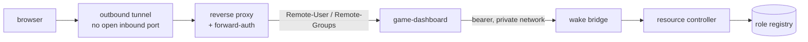

# game-dashboard

A small web UI in front of an on-demand resource controller. The controller keeps
a memory-constrained node quiet by running only one heavy role at a time; this is
the front end that lets a handful of trusted people wake a role themselves
instead of asking the owner. It shows what is running, what is asleep, what is
occupied, and how much memory is left.

## Why the roles are enforced on the server

The identity comes from a forward-auth layer as request headers. That is
convenient and completely untrustworthy on its own: headers are just text, and
anything that reaches the app directly can claim to be an administrator.

So the app treats the proxy as the only acceptable source. A request that does
not arrive through the trusted path is refused with 403 before any handler runs,
and every privileged action re-checks the group on the server side. The frontend
also hides buttons a viewer may not use, but that is cosmetic only: hiding a
button is a courtesy to the user, never a security control. Removing the UI
check changes nothing about what the API allows.

Two roles, deliberately few:

| Group | May |
|-------|-----|
| `user`  | see the roles and start (wake) them |
| `admin` | additionally stop, restart, and displace an occupied slot |

## Design notes

- **The role list is not hardcoded.** It is read from the controller's own
  registry at runtime, so a role added on the node shows up here without a code
  change or redeploy.
- **Not everything on the node is exposed.** The lab machines are deliberately
  absent from this UI and stay behind the administrative portal. A dashboard
  shared with friends should not be able to reach them at all.
- **The bridge token never reaches the browser.** The UI talks to this service,
  this service talks to the bridge.
- **No inbound port.** Public access runs through an outbound tunnel; the service
  itself binds to loopback.

## Layout

- `app/auth.py` — trusted-proxy check and group enforcement
- `app/bridge.py` — client for the wake bridge, including bearer handling
- `app/games.py` — role list derived from the controller's registry
- `app/main.py` — routes and the server-side permission checks
- `app/static/` — the UI: one HTML file, one stylesheet, one script, no framework
- `docker-compose.yml` — hardened runtime: read-only, dropped capabilities, loopback bind

MIT licensed.
