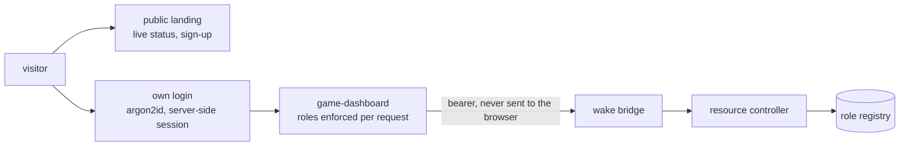

# game-dashboard


A web front end for an on-demand resource controller. The controller starts heavy
services when somebody asks for them and switches them off again when nobody is
on them; this is the page that lets the people who use those services do the
asking themselves, instead of going through me. It shows what is up, what is
asleep, whether anyone is on it, and how much memory the host has left.


```mermaid
flowchart LR
  visitor[visitor] --> land[public landing<br/>live status, sign-up]
  visitor --> login[own login<br/>argon2id, server-side session]
  login --> dash[game-dashboard<br/>roles enforced per request]
  dash -->|bearer, never sent to the browser| bridge[wake bridge]
  bridge --> arb[resource controller]
  arb --> roles[(role registry)]
```

## Why it grew its own login

The first version took identity from a forward-auth layer: the reverse proxy
authenticated, and the app read `Remote-User` and `Remote-Groups` from the request
headers. That is a clean arrangement as long as everyone who signs in already has
an account in your infrastructure.

These users do not. They are people from outside who want to use one service, and
handing each of them an account in an identity provider that also guards
everything else is both too much work and too much access. So the page now
authenticates on its own: argon2id for the passwords, sessions server-side in
SQLite with nothing but an opaque token in the cookie, a per-session CSRF token
on every state-changing call. Joining goes through an application or an
invitation rather than self-registration.

The header lesson survived the rewrite, because it is the more important half:
whatever the browser sends is a claim, not a fact. Every privileged call resolves
the session server-side and checks the role again. The frontend does hide buttons
a member cannot use, but that is a courtesy to the person looking at the screen.
Deleting the check in the browser gains nobody a single permission.

| Role | May |
|------|-----|
| `member` | see the services and start (wake) them |
| verified `member` | additionally download the saved world state |
| `admin` / `owner` | additionally stop, restart, switch worlds, and manage members |

Nobody, at any level, can displace someone who is mid-session. An earlier version
offered admins a force button for exactly that; it is gone, and a refusal from the
controller is now final for everyone.

## Design notes

- **The role list comes from the controller.** It is read from the registry at
  runtime, so a role added on the node appears here without a code change or a
  redeploy.
- **The lab machines are left out.** They stay behind the administrative portal.
  A page I share with people from outside has no business reaching them.
- **The bridge token never reaches the browser.** The UI talks to this service,
  and this service talks to the bridge.
- **The app itself binds to loopback.** TLS and the public address belong to the
  web server in front of it, so there is exactly one place where certificates and
  public exposure are configured.
- **Every action is written to an audit log** with the user who triggered it.
  Shared control is only workable if it stays attributable afterwards.

## Layout

- `app/auth.py`: sessions, roles and the verified flag
- `app/security.py`: argon2id hashing, token generation, rate limiting
- `app/bridge.py`: client for the wake bridge, including bearer handling
- `app/games.py`: service list derived from the controller's registry
- `app/vault.py`: saved world state, served only to verified members
- `app/routers/`: public pages, member API, admin, and the chat-bot endpoints
- `docker-compose.yml`: hardened runtime, read-only with dropped capabilities and a loopback bind

MIT licensed.

## Tests

```bash
pip install -r requirements.txt pytest
pytest -q
```

The suite is about the parts that carry the exposure: role and verified
enforcement on every endpoint, a CSRF token on every state-changing call, the
rate limits, path traversal on the world download, session expiry and cookie
attributes, the invitation flow including role fields smuggled into the form,
and what the public page gives away. Nothing reaches the network; the bridge
client is stubbed for the whole run.

Two details that matter when adding to it. The role tables in
`tests/test_rollen.py` are compared against `app.routes`, so a new endpoint that
nobody wrote a test for fails the suite instead of passing quietly. And the
tests were checked against ten deliberate mutations (role check removed, CSRF
check removed, path containment removed, rate limiter disabled, session expiry
ignored, and so on): each one was caught by the file responsible for it. A green
suite that measures nothing is worse than no suite, because it reads like
evidence.

## About this snapshot

The private version of this repo contains the real service names, the web server
configuration and the address of the bridge it talks to. A script removes those,
replaces internal addresses and paths with placeholders, and will not push unless
two separate secret scanners come back clean.

Hence the single commit instead of the actual history. The service runs on the
same host as the things it controls, which is the arrangement that removed a
whole tunnel and a set of forwarding rules from the picture: when the controller
sits next to what it controls, there is no remote network path left to secure.
